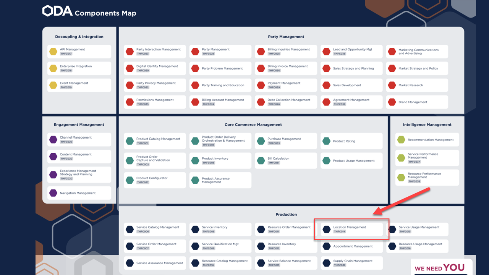

<!---->

# Lineamientos de Location Management

## Control de versiones

| Versión | Fecha      | Responsable | Comentarios                                                                             |
| ------- | ---------- | ----------- | --------------------------------------------------------------------------------------- |
| V0.1     | 14/12/2023 | Arquitectura de Soluciones & Empresarial      | Versión Inicial                      |

## Índice

- [Lineamientos de Location Management](#lineamientos-de-location-management)
  - [Control de versiones](#control-de-versiones)
  - [Índice](#índice)
  - [Introducción](#introducción)
  - [Alcance](#alcance)
  - [Audiencia](#audiencia)
  - [Ubicación en los Frameworks de Referencia del TM Forum](#ubicación-en-los-frameworks-de-referencia-del-tm-forum)
    - [Framework de Aplicaciones TAM](#framework-de-aplicaciones-tam)
    - [Funciones del Location Managemen](#funciones-del-location-managemen)
    - [Open Digital Architecture ODA](#open-digital-architecture-oda)
  - [Arquitectura de Referencia](#arquitectura-de-referencia)
  - [Lineamientos](#lineamientos)
  
  
## Introducción

Documento elaborado por la Gerencia de Arquitectura y Evolución Tecnológica Hispam, con el propósito de establecer los principios y lineamientos de arquitectura, los cuales deben ser contemplados por las operadoras del grupo de Hispam para la implementación y/o evolución de sus sistemas con  la aplicación de Location Management.

## Alcance

El alcance de este documento es definir una arquitectura de referencia, y establecer los principios, lineamientos y funcionalidades básicas que deben ser cubiertas por la solución de Location Management en todo su ámbito de aplicación, considerando los macroprocesos asociados, basados en eTOM y las funcionalidades según TAM.
No es parte del alcance, definir qué herramienta particular debe seleccionarse para cubrir el dominio funcional de Location Management. 

 

## Audiencia

Las áreas o grupos a los que está dirigido este documento, son aquellos que tienen relación con los proyectos de evolución y/o selección y posterior implementación de una herramienta de Location Management convergente en las distintas operaciones de la región. Entre ellos consideramos a las áreas regionales Hispam de Planificación, Sistemas Back End y Gestión de Proyectos, otras áreas usuarias de cada OB, y a todos aquellos grupos afines que de alguna u otra manera tengan relación con dichos proyectos.  

## Ubicación en los Frameworks de Referencia del TM Forum

### Framework de Aplicaciones TAM

A nivel del framework de aplicaciones TAM, las funcionalidades de “<strong><em>Location Management</em></strong>” están situadas dentro de las intersecciones entre la vertical de “Operations Readiness & Support” y los dominios del “Service Domain”.

El Location Management proporciona la funcionalidad necesaria para gestionar los atributos físicos y lógicos de los datos de ubicación para el proveedor de servicios. Puede incluir direcciones (calle, ciudad, estado/provincia y país), información geoespacial (latitud/longitud), así como información de código común (como CLLI - Identificador de ubicación de lenguaje común). Este inventario de ubicación puede incluir tanto datos de ubicación del cliente como datos de ubicación del proveedor de servicios (cualquier cosa de interés para el proveedor de servicios para respaldar sus necesidades operativas).

### Funciones del Location Managemen

* __Personalización de la estructura de ubicación__
Proporcionar funciones para crear, modificar y eliminar estructuras de datos de acuerdo con las reglas comerciales de los proveedores de servicios o las regulaciones de ubicación nacionales e internacionales. 
* __Búsqueda de ubicación__
  Capacidad de devolver coincidencias cercanas si no se encuentra una coincidencia exacta.
* __Integridad del repositorio__
  Capacidad de mantener la integridad de los datos en todo el repositorio de ubicación.
* __Reabastecimiento de ubicación__
  Actualizar el repositorio con información de ubicación nueva/actualizada  de fuentes externas.
* __Perfiles de ubicación__
  Debe generar diferentes vistas para diferentes casos de negocios.
* __Historial de cambios__
  Seguimiento de todos los cambios de datos de ubicación.

### Open Digital Architecture ODA

A nivel de Open Digital Architecture, las funcionalidades de "Location Mangement” están situadas dentro *__production__* como el componente __TMFC014__. 

El Componente de Location Management, parte de la Arquitectura Digital Abierta (ODA), se utiliza como una clase de conveniencia que permite una fácil referencia a lugares geográficos importantes para otras entidades, donde un lugar geográfico es una entidad que puede responder a la pregunta <em>"¿dónde?"</em> También cubre las operaciones para administrar (crear, leer, eliminar) sitios que pueden asociarse con un cliente, cuenta, prestación de servicios u otras entidades. Y finalmente, brinde la capacidad de recuperar/enumerar/validar las direcciones geográficas que se nombran como formas textuales estructuradas de describir cómo encontrar una propiedad en un área urbana (las propiedades de los países a menudo se definen de manera diferente).

## Arquitectura de Referencia

## Lineamientos

[- LOC_001 GID](LOC_001_GIS.md)
[- LOC_002 CAPAS](LOC_002_CAPAS.md)
[- LOC_003 NORMALIZACIÓN](LOC_003_NORMALIZA.md)
[- LOC_004 DATOS](LOC_004_CAPDATOS.md)

